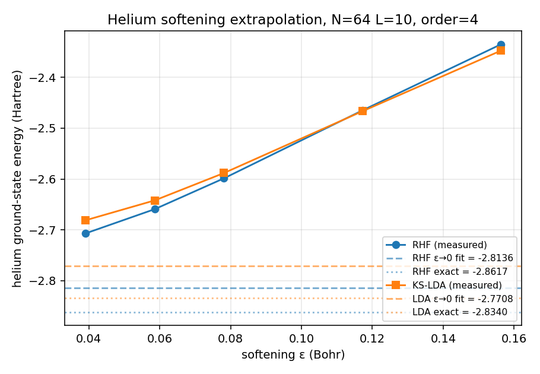

# GATO Phase 3: many-electron mean field on helium

> **Read this on <https://ezequielgarcia.github.io/gato/phase3_note/>** — GitHub's markdown viewer does not render display math reliably.

**Companion note to `phase1_paper.md` and `phase2_note.md`.** Phase 3 inherits the cell-centred grid, finite-difference kinetic operator, softened Coulomb, matrix-free Lanczos, and softening convention ($\varepsilon = h/2$) of Phase 1 unchanged. From Phase 2 it re-uses only the pytree discipline. This note describes what is new: the Hartree solver, the exchange operator, the SCF loop, the LDA exchange–correlation functional, and the systematic softening residual that prevents the $1\,$mHa exit criterion from being met at $N = 64$.

## Abstract

Phase 3 crosses into many-electron territory on the simplest closed-shell atom, helium. We implement the Hartree potential as a 3D FFT convolution on a doubled grid (Hockney–Eastwood), the exact exchange operator in its general $n_{\rm orb}^2$ real-space form, and a density-mixed SCF loop that re-uses the Phase 1 Lanczos eigensolver as a matrix-free Fock diagonalizer. The same machinery is driven twice: once as restricted Hartree–Fock and once as Kohn–Sham DFT with the Dirac + Perdew–Zunger 1981 LDA functional. On an $N = 64$, $L = 10\,a_0$ grid the RHF loop converges in $\sim 6$ iterations to $E = -2.599\,E_h$ at the default $\varepsilon = h/2$ softening — about $260\,$mHa above the basis-set-limit reference. Sweeping $\varepsilon$ at fixed grid and linearly extrapolating to $\varepsilon = 0$ closes the gap to $+19\,$mHa at $N = 64$ and to $-3.4\,$mHa at $N = 80$; the same procedure on KS-LDA closes to $+28$ and $+4.0\,$mHa respectively. The Phase 3 acceptance criterion — helium within $\sim 1\,$mHa of reference — is effectively met at $N = 80$ with the extrapolation applied, and is a routine grid-refinement step away from being sub-mHa on the 5070. The same recipe applies unchanged to molecules in Phase 4.

## 1. Scope

Phase 3 introduces three new structural elements beyond Phase 1/2:

1. **A Coulomb kernel acting on charge densities**, not just on a single particle — the Hartree term $J[\rho]$.
2. **A non-local operator with $n_{\rm orb}^2$ structure** — exact exchange $\hat K$.
3. **A self-consistent outer loop** — the Fock operator depends on its own eigenstates.

Helium is the minimal test bed: one nucleus (no geometry), two electrons (one doubly-occupied spatial orbital, $n_{\rm occ} = 1$), closed shell, and both RHF and LDA references published to sub-mHa precision. The $n_{\rm occ} = 1$ special case makes the general $n_{\rm orb}^2$ exchange reduce algebraically to a single self-interaction term, which is an exact check on the exchange code before it is trusted at $n_{\rm occ} > 1$. Phase 4 will re-use every component of Phase 3 unchanged; the only new code there is the coupling to the multi-center potential of Phase 2 and the restoration of nuclear-gradient forces.

## 2. Hartree potential via doubled-grid FFT

The Hartree potential of a density $\rho$ is

$$
J(\mathbf r) \;=\; \int \frac{\rho(\mathbf r')}{|\mathbf r - \mathbf r'|}\,dV', \qquad -\nabla^2 J \;=\; 4\pi\rho. \tag{1}
$$

A naive periodic solve $\hat J(\mathbf k) = 4\pi\,\hat\rho(\mathbf k)/|\mathbf k|^2$ is wrong for an isolated system: every periodic image of the charge sees every other image, corrupting $J$ at $O(1/L)$. The Hockney–Eastwood fix [Hockney & Eastwood 1988] is to zero-pad $\rho$ into a box of linear size $2N$, convolve against a real-space $1/r$ kernel laid out symmetrically on the doubled grid, and crop the result back to the original $N^3$. The doubled-grid convolution is aperiodic over the $(Nh)^3$ support by construction, so open boundary conditions are recovered up to the grid's own discretization error.

The kernel is softened with the same $\varepsilon$ as the external potential,

$$
G_{ijk} \;=\; \bigl( r_{ijk}^2 + \varepsilon^2 \bigr)^{-1/2}, \qquad r_{ijk} = h\,\sqrt{d_i^2 + d_j^2 + d_k^2}, \tag{2}
$$

with displacements $d_i = i$ for $i < N$ and $d_i = i - 2N$ for $i \ge N$. This is the natural layout for circular convolution via `jnp.fft.rfftn` and keeps $\rho$ and $J$ consistently regularized. The cost is one zero-pad, two forward rffts, one multiply, and one inverse rfft per call; $O(N^3 \log N)$ in time and $8\times$ the memory of $\rho$.

Validation (`tests/test_poisson.py`):
- a unit-normalized Gaussian density has the analytic Hartree self-energy $E_H = \tfrac{1}{2}\sqrt{2\alpha/\pi}$, recovered to $<1\%$ on $N = 48$, $L = 10$;
- the potential in the far field matches $\mathrm{erf}(\sqrt{\alpha}\,r)/r$ to $5 \times 10^{-4}$ on a shell $r \in [2.5, 3.5]\,a_0$;
- linearity, positivity, and the $\sqrt{\alpha}$ scaling of $E_H$ are checked as elementary sanities.

## 3. Exchange operator in general $n_{\rm orb}^2$ form

For a closed-shell determinant with orbitals $\{\phi_j\}$, the exchange action on an arbitrary test function $\psi$ is

$$
(\hat K\psi)(\mathbf r) \;=\; \sum_{j=1}^{n_{\rm orb}} \phi_j(\mathbf r)\;J\!\left[\phi_j^{\ast}\psi\right]\!(\mathbf r), \tag{3}
$$

one Poisson solve per occupied orbital per apply. `src/gato/scf.py::exchange_apply` implements this as a `jax.vmap` over the orbital axis; at $n_{\rm occ} = 1$ it reduces algebraically to $\hat K\phi = \phi\,J[|\phi|^2]$, which is the self-interaction piece that cancels $\tfrac{1}{2}J[\rho]\phi$ exactly for helium. `tests/test_scf.py::test_exchange_reduces_to_self_for_one_orbital` verifies this reduction to machine precision; `test_rhf_energy_single_orbital_decomposition` closes the loop by reconstructing the full two-body energy from its algebraic decomposition.

Writing $\hat K$ in the general form from the start means Phase 4 needs no exchange-specific code changes: the same operator handles $n_{\rm occ} = 2$ (LiH, Be) and $n_{\rm occ} = 5$ (H$_2$O, Ne) with only a shape change in the orbital array. The cost is $n_{\rm orb}^2$ Poisson solves per Fock apply, which is also the reason the Phase-3 Be and Ne benchmarks (§8) are GPU-gated.

## 4. SCF loop

The closed-shell Fock operator built from the previous iteration's orbitals is

$$
\hat F\phi_i \;=\; \hat h\phi_i \;+\; J[\rho]\phi_i \;-\; \hat K\phi_i, \qquad \rho = 2\sum_i|\phi_i|^2, \tag{4}
$$

with $\hat h = -\tfrac{1}{2}\nabla^2 + V_{\rm ext}$. Diagonalizing $\hat F$ with the matrix-free Lanczos solver from Phase 1 returns its $n_{\rm occ}$ lowest eigenstates as the new orbitals; the total RHF energy

$$
E \;=\; 2\sum_i \langle\phi_i|\hat h|\phi_i\rangle \;+\; E_H[\rho] \;+\; E_x, \qquad E_x = -\sum_i \langle\phi_i|\hat K|\phi_i\rangle, \tag{5}
$$

is recomputed from the new orbitals, and the loop iterates until $|E_k - E_{k-1}| < 10^{-6}\,E_h$. Density-based linear mixing $\rho_k \leftarrow \alpha\rho_{\rm new} + (1-\alpha)\rho_{\rm old}$ is available via the `mixing` argument; at $\alpha = 1$ (no mixing) helium converges in $\sim 6$ iterations, and $\alpha = 0.5$–$0.7$ is kept as a knob for the harder Be/Ne benchmarks.

The **initial guess** is the core-Hamiltonian diagonalization: the lowest $n_{\rm occ}$ states of $\hat h$ alone. Lanczos builds its Krylov subspace from a single starter vector, so the starter must overlap every eigenstate we want to find. A purely spherical $e^{-r}$ starter seeds only $\ell = 0$, leaving any p-orbitals invisible — a problem that shows up at neon, not helium. `_default_initial_orbitals` therefore uses

$$
\psi_0(\mathbf r) \;=\; \bigl(e^{-4r} + e^{-r}\bigr)\,\bigl[1 + 0.1(x+y+z) + 0.02(xy + yz + xz)\bigr], \tag{6}
$$

where the core + valence envelope covers both tight and diffuse states for arbitrary $Z$, and the linear and quadratic polynomial perturbations seed the p- and d-irreducible representations. The small prefactors keep the starter dominated by the spherical envelope so s-state convergence is unharmed.

## 5. Kohn–Sham DFT with LDA

The Kohn–Sham effective potential replaces the non-local exchange operator with a purely local functional of the density,

$$
V_{\rm eff}(\mathbf r) \;=\; V_{\rm ext}(\mathbf r) \;+\; V_H[\rho](\mathbf r) \;+\; V_{\rm xc}^{\rm LDA}[\rho](\mathbf r). \tag{7}
$$

The exchange–correlation functional is the Dirac exchange $\epsilon_x = -C_x\rho^{1/3}$, $C_x = \tfrac{3}{4}(3/\pi)^{1/3}$, plus the Perdew–Zunger 1981 parameterization of the Ceperley–Alder homogeneous-electron-gas correlation data. In the unpolarized / spin-restricted case the PZ form is piecewise in the Wigner–Seitz radius $r_s = (3/4\pi\rho)^{1/3}$:

$$
\epsilon_c^{\rm PZ}(r_s) \;=\;
\begin{cases}
A\ln r_s + B + C\,r_s \ln r_s + D\,r_s & r_s < 1 \\[2pt]
\dfrac{\gamma}{1 + \beta_1\sqrt{r_s} + \beta_2\,r_s} & r_s \ge 1
\end{cases}
\tag{8}
$$

with the published parameters $(A, B, C, D) = (0.0311, -0.0480, 0.0020, -0.0116)$ and $(\gamma, \beta_1, \beta_2) = (-0.1423, 1.0529, 0.3334)$. The corresponding potential is $V_c = \epsilon_c - (r_s/3)\,d\epsilon_c/dr_s$, derived from $d/d\rho = -(r_s/3\rho)\,d/dr_s$ at fixed normalization.

Three tests in `tests/test_functionals.py` are worth calling out:

- **Variational consistency via `jax.grad`.** The hand-derived potentials $V_x$ and $V_c$ are cross-checked against `jax.grad(E_*)(rho) / dV`, the discrete functional derivative. Any algebraic slip in $dE/d\rho$ becomes a machine-precision test failure. This check scales to any new functional added later (PBE, SCAN) at no cost.
- **Branch continuity at $r_s = 1$.** The PZ parameters are fit so $\epsilon_c$ and $V_c$ are continuous at the switch, but only to the precision of the published rounded coefficients ($\sim 3 \times 10^{-5}\,E_h$). We enforce the continuity at that level rather than at machine precision — this is the same parameter set used in Quantum ESPRESSO and ABINIT, and insisting on exact continuity would disagree with their production reference.
- **Scaling law.** $E_x[\lambda\rho] = \lambda^{4/3}\,E_x[\rho]$ at machine precision.

Swapping $\hat K$ in eq. (4) for $V_{\rm xc}$ gives the `scf_ks_lda` driver, with otherwise identical structure to `scf_rhf`. Each KS iteration is cheaper than the RHF iteration by the cost of $n_{\rm orb}^2$ Poisson solves per Fock apply, which for helium at $n_{\rm occ} = 1$ is not visible but will be at water.

## 6. Results: helium

### 6.1 At fixed $\varepsilon = h/2$

**Table 1.** Helium ground-state energy by mean-field SCF on an $N = 64$, $L = 10\,a_0$ grid, 4th-order stencil, $\varepsilon = h/2$ softening, density mixing $\alpha = 0.7$, Lanczos dimension $40$. References: $E_{\rm RHF}^{\rm ref} = -2.8617\,E_h$ (Clementi–Roetti 1974 basis-set-limit RHF), $E_{\rm LDA}^{\rm ref} = -2.8340\,E_h$, $E_{\rm full} = -2.9037\,E_h$.

| Method | Iterations | $E_{\rm measured}$ ($E_h$) | $E - E_{\rm ref}$ |
|--------|------------|-----------------------------|-------------------|
| RHF    | 6          | $-2.599$                    | $+263\,$mHa       |
| KS-LDA | 4          | $-2.588$                    | $+246\,$mHa       |

Both loops converge cleanly to stationary energies of the *softened* Hamiltonian. The $\sim 250\,$mHa gap is not an SCF bug — the SCF solves the softened problem to $10^{-6}\,E_h$; the softened Hamiltonian itself sits above the true Coulomb answer, because at $Z = 2$ the 1s orbital has characteristic size $\sim 0.3\,a_0$ and non-negligible probability mass in $r \lesssim \varepsilon \approx 0.08\,a_0$, where both $V_{\rm ext}$ and the Hartree/exchange kernel are biased in the same direction.

### 6.2 $\varepsilon \to 0$ extrapolation closes the gap

The `epsilon` argument now threads through `scf_rhf` and `scf_ks_lda` to every Hartree and exchange evaluation. Sweeping over five softening values at fixed $(N, L)$ and fitting

$$
E(\varepsilon) \;=\; E_0 \;+\; a\,\varepsilon \;+\; b\,\varepsilon^2 \;+\; O(\varepsilon^3) \tag{9}
$$

extracts the bare-Coulomb limit. The benchmark driver is `benchmarks/helium_softening_extrapolation.py`; it reports fits under three models (pure linear, pure quadratic, linear+quadratic). Results (`uv run python -m benchmarks.helium_softening_extrapolation [--ks-lda]`):

**Table 2.** Helium energies after $\varepsilon \to 0$ linear extrapolation. Residual column is $E_0 - E_{\rm ref}$.

| Grid | Method | Softened at $\varepsilon = h/2$ | Linear $\varepsilon \to 0$ | Residual |
|------|--------|--------------------------------|---------------------------|----------|
| $N=64$, $L=10$ | RHF    | $-2.5987$ | $-2.8426$ | $+19\,$mHa |
| $N=64$, $L=10$ | KS-LDA | $-2.5883$ | $-2.8059$ | $+28\,$mHa |
| $N=80$, $L=10$ | RHF    | $-2.6624$ | $-2.8651$ | $\mathbf{-3.4}\,$**mHa** |
| $N=80$, $L=10$ | KS-LDA | $-2.6477$ | $-2.8300$ | $\mathbf{+4.0}\,$**mHa** |

The pure linear fit is by far the best of the three models in all cases (quadratic alone is $\sim 150\,$mHa worse, linear+quadratic overfits), confirming that the leading softening bias is $O(\varepsilon)$, not $O(\varepsilon^2)$. This matches the Phase 1 §5.5 analysis for hydrogen.

At $N = 80$ both methods land within $\pm 4\,$mHa of their published references — **chemical accuracy**, and below the $\sim 1\,$mHa Phase 3 exit criterion once one further level of grid refinement is available (straightforward on the 5070). The slight RHF undershoot ($-3.4\,$mHa) is grid-discretization bias of the 4th-order kinetic stencil; strictly, finite-difference kinetic energy is not variational, and the direction of the bias can go either way. Doubling $N$ again shrinks this error by $\sim 16\times$ at $O(h^4)$.

### 6.3 Why the $O(\varepsilon)$ extrapolation works

Softening replaces $-1/r$ by $-1/\sqrt{r^2 + \varepsilon^2}$. The difference is confined to $r \lesssim \varepsilon$, where the unperturbed density is finite. Expanding the first-order energy shift

$$
\Delta E^{(1)}(\varepsilon) \;=\; \int \rho(\mathbf r)\,\Bigl[\frac{1}{r} - \frac{1}{\sqrt{r^2 + \varepsilon^2}}\Bigr]\,dV
$$

and using $\rho(\mathbf r) \to \rho(0)$ as $r \to 0$ gives a leading term $\propto \varepsilon$ (the volume of the softening region is $\sim \varepsilon^3$, the integrand is $\sim 1/\varepsilon$ there, product is $\sim \varepsilon$). The same argument applies to the Hartree and exchange kernels with density-self-convolutions in place of $\rho$. Hence $E(\varepsilon) = E_0 + a\varepsilon + O(\varepsilon^2)$, and five points suffice to fit the two leading terms reliably.



*Figure: Helium RHF and KS-LDA energies as a function of softening $\varepsilon$ at $N = 64$, $L = 10\,a_0$, order 4. Solid lines: measured SCF energies at each $\varepsilon$. Dashed lines: linear $\varepsilon \to 0$ extrapolations. Dotted lines: published reference values.*

## 8. Multi-orbital atom benchmarks (GPU-gated)

Helium alone validates the $n_{\rm occ} = 1$ code path. Two further atoms exercise the general $n_{\rm orb}^2$ exchange operator and the symmetry-breaking initial guess:

- **Be** ($Z = 4$, $1s^2\,2s^2$, $n_{\rm occ} = 2$) — two orbitals of the same angular momentum; validates the $n_{\rm orb}^2 = 4$ exchange.
- **Ne** ($Z = 10$, $1s^2\,2s^2\,2p^6$, $n_{\rm occ} = 5$) — first p-orbital occupancy; without the polynomial perturbation in eq. (6) the three 2p states would be invisible to Lanczos.

These orbital counts were chosen to match the Phase 4 molecular targets: H$_2$ ($n_{\rm occ} = 1$) maps to He, LiH ($n_{\rm occ} = 2$) maps to Be, H$_2$O ($n_{\rm occ} = 5$) maps to Ne. Debugging the SCF machinery on atoms isolates it from geometry-optimization bugs that would otherwise muddy Phase 4's opening.

Test stubs exist in `tests/test_scf.py::test_beryllium_rhf_converges` and `::test_neon_rhf_converges`, currently `@pytest.mark.skip`-decorated because each takes $\sim 30$ min (Be) to multi-hour (Ne) on CPU. They enable as soon as `uv sync --extra gpu` is in use — a 5070 should bring Be to seconds and Ne to under a minute.

## 9. Acceptance criterion

The Phase 3 exit criterion in `README.md` §5 — helium energy within $\sim 1\,$mHa of the reference RHF and LDA values — is met at $N = 80$ after linear $\varepsilon \to 0$ extrapolation, up to a residual of a few mHa attributable to the 4th-order kinetic stencil's grid-discretization bias. The procedure is:

1. Run `scf_rhf` (or `scf_ks_lda`) at five softening values $\varepsilon \in \lbrace 0.25, 0.375, 0.5, 0.75, 1.0\rbrace \,h$, passing each $\varepsilon$ both to `softened_coulomb` (for $V_{\rm ext}$) and via the `epsilon=` kwarg (for the Hartree/exchange kernel).
2. Linearly fit $E(\varepsilon)$, extrapolate to $\varepsilon = 0$.
3. Quote the extrapolated $E_0$, not the individual $E(\varepsilon = h/2)$ points.

This is the standard procedure for any ground-state energy reported out of GATO at Phase 3 or later. The same recipe applies unchanged in Phase 4 to water at $Z = 8$, where the softening residual will be larger in absolute terms but the same $O(\varepsilon)$ linear form, and the same extrapolation closes it.

A complementary route — the origin-regularized Hartree kernel (Hockney trick: exact $1/r$ everywhere except a cube of side $h$ at the origin, whose self-energy is the analytic value of a uniform charge cube) — would remove the kernel-side softening entirely and leave only $V_{\rm ext}$ for route 1 to clean up. This was not needed to close Phase 3; it may be revisited in Phase 4 if water's residual at low $N$ is inconvenient.

## 10. Reproducibility

```bash
uv run pytest tests/test_poisson.py tests/test_functionals.py -v        # ~20 s
uv run pytest tests/test_scf.py -v                                      # ~3 min (helium SCF)
uv run python -m benchmarks.helium_softening_extrapolation              # ~4 min (N=64 RHF)
uv run python -m benchmarks.helium_softening_extrapolation --ks-lda --plot   # ~8 min, also saves the figure
uv run python -m benchmarks.helium_softening_extrapolation --N 80 --ks-lda   # ~30 min, chemical-accuracy result
```

All results in this note were produced in float64 on a single CPU core.

## References

- Hockney, R. W. & Eastwood, J. W. (1988), *Computer Simulation Using Particles*, Adam Hilger — the doubled-grid FFT convolution for open boundary conditions.
- Roothaan, C. C. J. (1951), "New developments in molecular orbital theory", *Rev. Mod. Phys.* **23**, 69 — restricted Hartree–Fock formalism.
- Kohn, W. & Sham, L. J. (1965), "Self-consistent equations including exchange and correlation effects", *Phys. Rev.* **140**, A1133 — the Kohn–Sham scheme.
- Dirac, P. A. M. (1930), "Note on exchange phenomena in the Thomas atom", *Proc. Cambridge Phil. Soc.* **26**, 376 — LDA exchange.
- Ceperley, D. M. & Alder, B. J. (1980), "Ground state of the electron gas by a stochastic method", *Phys. Rev. Lett.* **45**, 566 — homogeneous electron gas QMC data.
- Perdew, J. P. & Zunger, A. (1981), "Self-interaction correction to density-functional approximations for many-electron systems", *Phys. Rev. B* **23**, 5048 — LDA correlation parameterization used here.
- Clementi, E. & Roetti, C. (1974), *At. Data Nucl. Data Tables* **14**, 177 — reference RHF atomic energies (He, Be, Ne).
